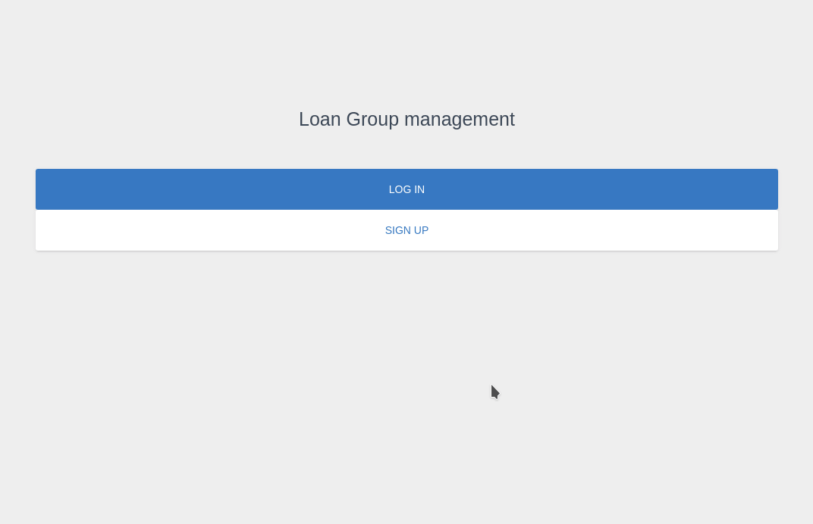

<p align="center">
    <h1 align="center"> Loan Group management </h1>    
</p>

<p align="center">
    <h2 align="center"> This is my Capstone solo project for Ruby on Rails Microverse Main Technical Curriculum section. </h2>
</p>

<p align="center">
    <a href="https://img.shields.io/badge/Microverse-blueviolet" alt="Contributors">
        </a>
    <a href="https://ruby-doc.org/core-2.7.0/Array.html" alt="Ruby">
        </a>
    <a href="https://rubyonrails.org/" alt="Rails">
        </a>
    <a href="https://rspec.info/documentation/" alt="Rspec-rails">
        </a>
    <a href="https://rubygems.org/gems/pg/versions/0.18.4?locale=es" alt="Postgresql">
        </a>
    <a href="https://www.heroku.com/" alt="Heroku">
        </a>
</p>

<p align="center">    
    <br />
    <a href="https://github.com/guillainbisimwa/Loan-Group-management"><strong>Explore this project »</strong></a>
    <br />
    <br />&#10023;
    <a href="#Prerequisites">Watch the Live Version</a> &#10023;
    <a href="#Prerequisites">Prerequisites</a> &#10023;
    <a href="#Getting-Started">Getting Started</a> &#10023;
    <a href="#Usage">Usage</a> &#10023;
    <a href="#Run-tests">Run tests</a> &#10023;
    <a href="#Deployment">Deployment</a> &#10023;
    <a href="#Watch-the-Live-Version">Watch the Live Version</a> &#10023;
    <a href="#Contributing">Contributing</a> &#10023;
    <a href="#Author">Author</a> &#10023;
    <a href="#Show-your-support">Show your support</a> &#10023;
    <a href="#License">License</a> &#10023;
    <a href="#Acknowledgments">Acknowledgments</a> &#10023;
    <a href="https://github.com/guillainbisimwa/Loan-Group-management/issues">Report Bug</a>    &#10023;

</p>

<br/>

<b>Loan Group management </b> is loan application system. It's a web application with a good responsive design, built with <b>Ruby on Rails</b> and It facilitates financial inclusion by giving loans to people.
You can find the full requirements <a href="https://www.notion.so/Group-our-transactions-ccea2b6642664540a70de9f30bdff4ce" alt="Requirements">here</a>. Exploring this project you can find these options (<b>login</b>, <b> sign-up</b>, <b> Create a group</b>, <b> sign-in</b>, <b> apply for a loan </b>, ...)



## Watch the Live Version

[Loan Group management](https://mysterious-beyond-28823.herokuapp.com/)

### Prerequisites

- Ruby 2.7.1 must be installed on your machine.
- Text Editor
- Rails 6.0.3
- Postgres: >=9.5
- Git
- A Bootstrap 4 UI Kit based on [Material Design](https://demos.creative-tim.com/material-kit/)
- End-to-End Testing with [RSpec](https://rspec.info/)
- Integration test with[Capybara](https://github.com/teamcapybara/capybara#using-capybara-with-rspec)

## Getting Started

1. Open Terminal.
2. Navigate to your desired location to download the contents of this repository.
3. Copy and paste the following code into the Terminal :
   `git clone https://github.com/guillainbisimwa/Loan-Group-management.git`
4. Run `cd Loan-Group-management`
5. Install the needed dependencies `yarn install`
6. Install the needed gems `bundle install`
7. Next, create and migrate the database: `rails db:create` and `rails db:migrate RAILS_ENV=development`
8. run `rails server`

### Usage

To watch the local version of this project check on your browser for the link :

```
`http://localhost:3000/`
```

### Run tests

Download and install google chrome if don't have it to run Capybara.
Capybara needs the web drivers to run system tests with browsers

```
wget https://dl.google.com/linux/direct/google-chrome-stable_current_amd64.deb

sudo apt install ./google-chrome-stable_current_amd64.deb
```

```
# rspec spec
```

### Deployment

To deploy this app to Heroku follow the steps below

Install the [Heroku CLI](https://devcenter.heroku.com/articles/heroku-cli)

After that type the command below into your teminal.

```
    heroku create
```

```
    git push heroku main
```

Finally, run the command to create your database Heroku

```
    heroku run rails db:migrate
```

## Contributing

This project was created for educational purposes as part of the Microverse web development curriculum; contributing is not accepted.

Feel free to check the [issues page](https://github.com/guillainbisimwa/Loan-Group-management/issues).

## Author

👤 **Guillain Bisimwa**

- Github : [@guillainbisimwa](https://github.com/guillainbisimwa)
- Twitter : [@gullain_bisimwa](https://twitter.com/gullain_bisimwa)
- Linkedin : [guillain-bisimwa](https://www.linkedin.com/in/guillain-bisimwa-8a8b7a7b/)

### Show your support

Give a ⭐️ if you like this project!

## License

This project is licensed under the MIT License

## Acknowledgments

- [Design idea by Gregoire Vella on Behance](https://www.behance.net/gregoirevella)
- [Creative Commons ](https://creativecommons.org/licenses/by-nc/4.0/)
